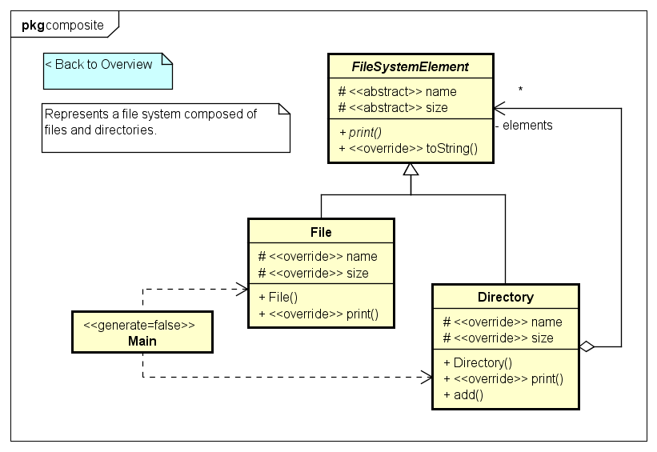
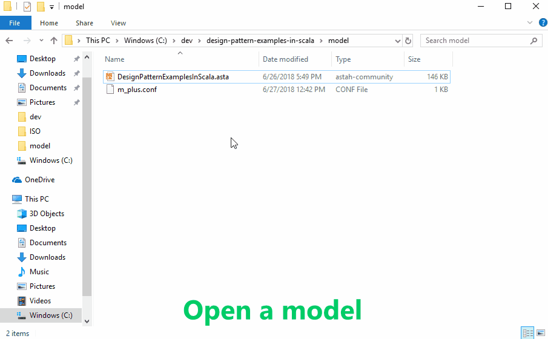
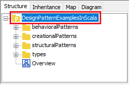

Design Pattern Examples in Scala
===

English | [日本語](README_ja.md)

Model and code examples of design patterns for Scala.  
You can utilize this examples as follows.

* You try Model-Driven Development (MDD) using Astah and M PLUS plug-in.
* You understand the mapping between UML model and Scala code.
* You understand the design pattern examples in Scala.  
  etc.

> UML model example:



> Scala code example:

```scala:File class
// ˅
package structuralPatterns.composite

// ˄

class File(_name: String, _size: Int) extends FileSystemElement {
  // ˅

  // ˄

  override protected val name: String = _name

  override protected val size: Int = _size

  // Print this element with the "upperPath".
  override def print(upperPath: String) = {
    // ˅
    println(f"$upperPath/$this")
    // ˄
  }

  // ˅

  // ˄
}

// ˅

// ˄
```

Installation
------------
**Astah**
* Download Astah Community or Professional from [Change Vision site](http://astah.net/download), and install.  
  The Community Edition is free, and the Professional Edition is paid.

**M PLUS plug-in**
* Download the plug-in from [M PLUS plug-in site](https://sites.google.com/view/m-plus-plugin/download), and install.  
  **Use ver.2.0 or higher.**

**Development Environment for Scala**
* Prepare an arbitrary development environment for Scala (e.g. [IntelliJ](https://www.jetbrains.com/idea/download/)).

Usage
-----
* Select model elements on the model browser of Astah, and press the "Generate code" button to generate.  
* The generated code has "User Code Area". The "User Code Area" is the area enclosed by "˅" and "˄". Handwritten code written in the "User Code Area" remains after a re-generation.
* You can run the program from "Main.scala" for each design pattern.
* For detailed usage of the tools, please see [Astah Manual](http://astah.net/manual) and [M PLUS plug-in Tips](https://sites.google.com/view/m-plus-plugin/tips).



References
----------
* Gamma, E. et al. Design Patterns: Elements of Reusable Object-Oriented Software, Addison-Wesley, 1994
* Hiroshi Yuki. Learning Design Patterns in Java [In Japanese Language], Softbank publishing, 2004

Contributing
------------
We welcome your contributions. Function addition, bug fix, refactoring, etc.  
The procedure is as follows.

1. Fork the repository and create your branch from master.
2. If you've changed model or code, check that the model and code are not separate. The check procedure is as follows.
    1. Select a project element on the model browser of Astah.  
    
    2. Press the "Generate code" button.  
    
    3. Check that the generated code is not updated.  
    
3. Issue the pull request!

Licence
-------
This project is licensed under the Creative Commons Zero (CC0) license. The model and code are completely free to be used.

[](http://creativecommons.org/publicdomain/zero/1.0/deed)
